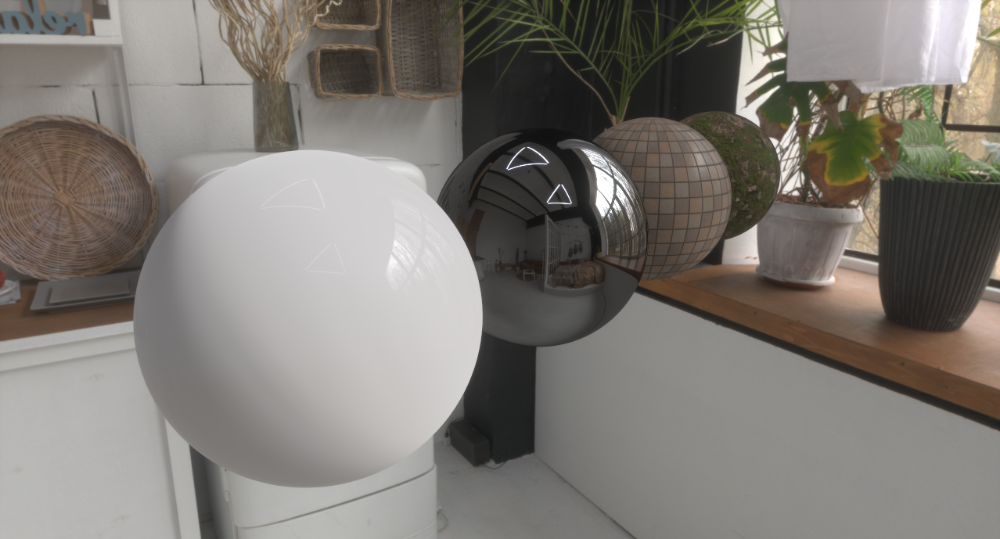
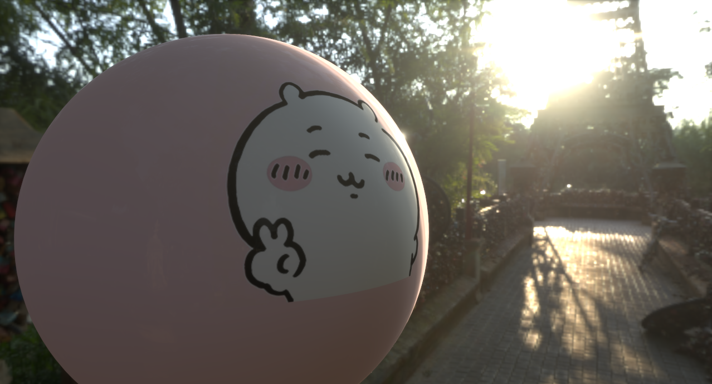
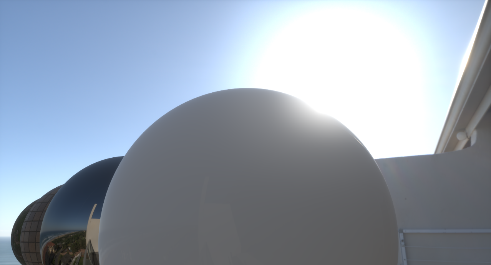

# PBR-Demo
 
A real-time graphics engine implements Physically Based Rendering (PBR) pipeline using the DirectX 12 API.

## Meshes
- [x] Support for .obj format mesh.
- [x] Support for .gltf format mesh.
- [x] Skybox.

## Camera
- [x] Controllable perspective camera.
- [x] Linear space rendering and tone mapping (Linear space to sRGB space).
- [x] Bloom effect.
- [ ] High quality bloom.
- [ ] Exposure adjustment.

## Textures
- [x] Support for OpenEXR format HDR textures.
- [x] Diffuse, normal, roughness, metalness, ambient occlusion textures.
- [x] Mipmaps.
- [x] Emission map.

## Lighting
- [x] Image Based Lighting.
- [ ] Light probes.
- [ ] Point light & directed light.
- [ ] Shadows.

## Materials
- [x] Unreal Engine 4 style diffuse and specular BRDF*.
  - [x] Pre-computed irradiance map.
  - [x] Importance sampling of GGX function.
  - [x] Pre-filtered environment map.
  - [x] Pre-integrated BRDF map.
- [x] Mipmap filtered sampling.
- [ ] Enhanced PBR pipelines.

\* Reference: https://cdn2-unrealengine-1251447533.file.myqcloud.com/Resources/files/2013SiggraphPresentationsNotes-26915738.pdf

## Others
- [x] Multisample anti-aliasing (MSAA).
- [x] Supersampling anti-aliasing (SSAA).

## Screenshots

